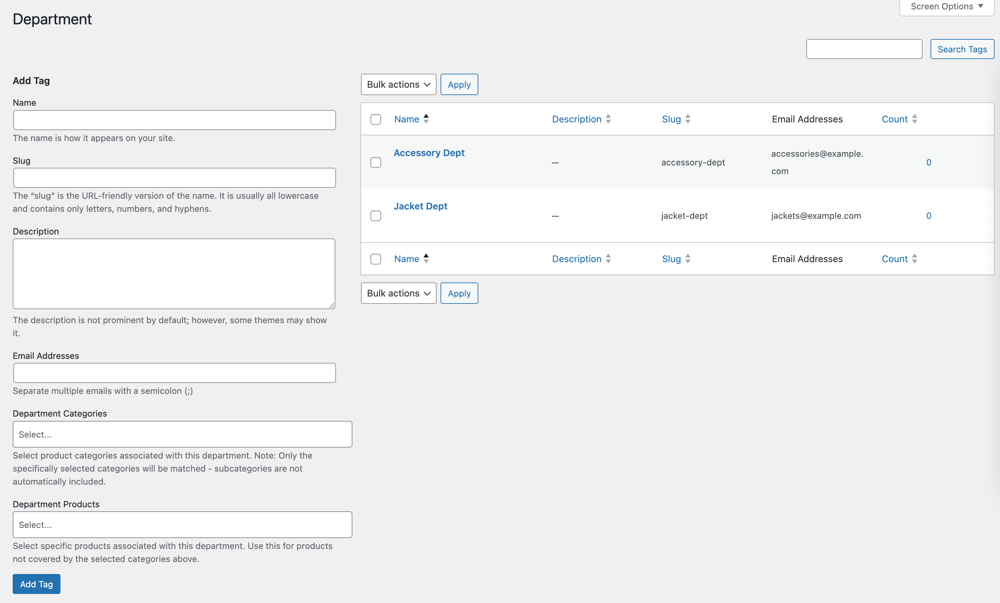
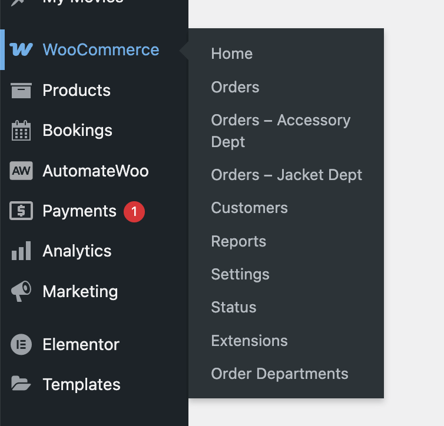
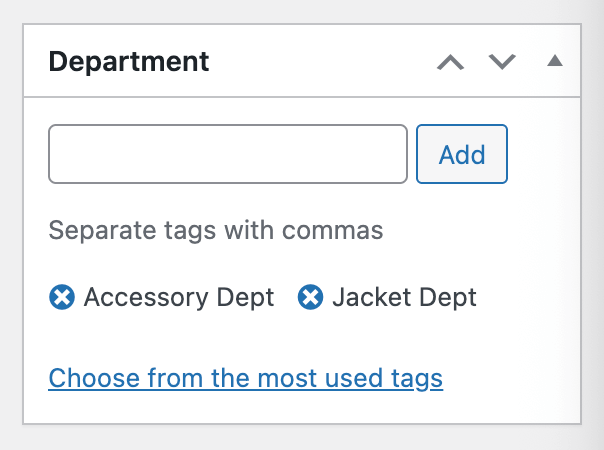
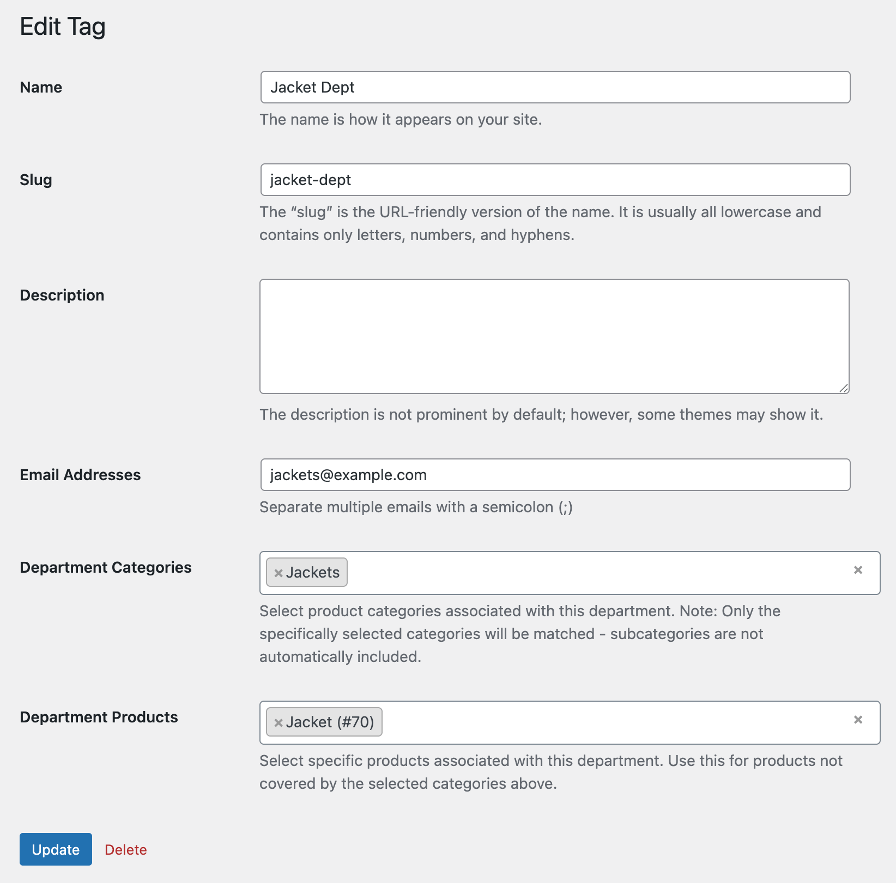

# WooCommerce Order Departments

Automatically assign orders to departments based on products and categories, with email routing and AutomateWoo integration.

## Description

WooCommerce Order Departments enables large organizations to automatically route orders to the appropriate departments based on the products or the categories of the products in each order.

For each department, a quick access menu is created below the WooCommerce.

The built in WooCommerce order emails can be re-routed so that only the relevant dept gets the order notification thats relevant to them.

The AutomateWoo integration then allows for further workflow automation based on department assignments.

## Features

- **Automatic Department Assignment**: Orders are automatically assigned to departments based on products/categories
- **Email Routing**: Route order emails to department-specific email addresses
- **Admin Filtering**: Filter orders by department in WooCommerce admin
- **Quick Access Menus**: Direct links to orders for each department
- **AutomateWoo Integration**: Complete set of actions, triggers, rules, and variables for workflow automation
- **Department Variables**: Access department data in AutomateWoo workflows (names, emails, counts)
- **HPOS Compatible**: Full support for WooCommerce High-Performance Order Storage

## Screenshots

1. **Department Taxonomy Management Screen** - Main interface for managing departments, viewing assigned orders, and configuring department settings.
   

2. **Custom Department Menus** - Quick access menus in WooCommerce admin for filtering orders by department.
   

3. **Department Meta Box on Order Screen** - View and manage department assignments directly from individual order pages.
   

4. **Edit Department Screen** - Configure department email addresses, product categories, and specific product assignments.
   

## AutomateWoo Integration

This plugin provides complete AutomateWoo integration, allowing you to create sophisticated workflows based on department assignments. The integration includes custom actions, triggers, rules, and variables specifically designed for department-based automation.

**Department Assignment Timing Tip**: This plugin assigns departments immediately during order processing using the product/category rules you configure in the taxonomy screens. This happens early enough to affect WooCommerce's core systems like email sending. AutomateWoo workflows run later in the process, so relying solely on AutomateWoo actions for department assignment would be too late to override WooCommerce's built-in emails and other core functionality.

**Using AutomateWoo for Email Handling**: If you prefer to handle all emails through AutomateWoo workflows instead of the built-in email routing:

1. Disable WooCommerce's default admin emails
2. Use AutomateWoo's email actions with department triggers for full control

This approach gives you the flexibility to use AutomateWoo's advanced email features (templates, conditions, delays, etc.) while still benefiting from automatic department assignment.

### Actions

- **Set Order Department**: Replace all existing departments with one department
- **Add Order Department**: Add a department while keeping existing ones
- **Remove Order Department**: Remove a specific department from an order
- **Clear Order Departments**: Remove all departments from an order

### Triggers

- **Order Department Added**: Fires when a department is added to an order
- **Order Department Removed**: Fires when a department is removed from an order
- **Order Department Changed**: Fires when departments are modified in any way

### Rules

- **Order Has Department**: Check if order has specific department(s)
- **Order Department Count**: Check the number of departments assigned
- **Order Department Is**: Check if order's departments exactly match a set

### Variables

**Collection Variables** (all departments):

- **`{{ order.departments_names }}`**: List of all department names assigned to the order
- **`{{ order.departments_emails }}`**: List of all department email addresses (automatically deduplicated)

**Per-Department Variables** (flexible access):

- **`{{ order.department_names }}`**: Department names with index/all/count options
- **`{{ order.department_emails }}`**: Department emails with index/all/count options
- **`{{ order.department_count }}`**: Number of departments assigned to the order

#### Variable Parameters

**Collection Variables** support `separator`, `prefix`, and `suffix` parameters:

- **`{{ order.departments_names | separator: ';' }}`** → "Sales;Technical;Support"
- **`{{ order.departments_names | prefix: 'Dept: ', suffix: ' Team' }}`** → "Dept: Sales Team, Dept: Technical Team"
- **`{{ order.departments_emails | separator: '; ' }}`** → "sales@example.com; tech@example.com"

**Per-Department Variables** support `mode`, `index`, `separator`, `prefix`, and `suffix` parameters:

**Mode Options:**

- **`{{ order.department_names }}`** → First department name (default mode: index)
- **`{{ order.department_names | mode: 'all' }}`** → All department names
- **`{{ order.department_names | mode: 'count' }}`** → Number of departments

**Index Access:**

- **`{{ order.department_names | index: '1' }}`** → First department name
- **`{{ order.department_names | index: '2' }}`** → Second department name
- **`{{ order.department_emails | index: '1' }}`** → All emails from first department

**Formatting:**

- **`{{ order.department_names | prefix: 'Team: ', suffix: ' Dept' }}`** → "Team: Sales Dept"
- **`{{ order.department_emails | separator: '; ' }}`** → Multiple emails separated by semicolon

## Use Cases

- **Sales & Technical Support**: Route orders containing software to Technical, hardware to Sales

  - Use `{{ order.departments_emails }}` to automatically send order notifications to the right team
  - Create conditional workflows based on `{{ order.department_count }}` for mixed orders

- **Multi-location Fulfillment**: Route orders to appropriate warehouses/locations

  - Include `{{ order.departments_names }}` in fulfillment emails to specify handling location
  - Use department variables in webhook payloads to external fulfillment systems

- **Specialized Teams**: Route complex products to specialist departments

  - Send detailed instructions using `{{ order.department_names }}` for single-department orders
  - Create escalation workflows when `{{ order.department_names | mode: 'count' }}` exceeds normal thresholds

- **CRM Integration**: Trigger department-specific workflows in external systems
  - Pass `{{ order.departments_names }}` to CRM systems for proper lead assignment
  - Use `{{ order.departments_emails }}` for automated follow-up sequences

## Installation

1. Upload the plugin files to `/wp-content/plugins/runthings-wc-order-departments/`
2. Activate the plugin through the 'Plugins' menu in WordPress
3. Go to `WooCommerce` > `Order Departments` to configure departments
4. Assign products/categories to departments
5. Set up email addresses for each department (optional)

## Configuration

### Setting Up Departments

1. Navigate to **WooCommerce > Order Departments**
2. Add new departments with:
   - Department name
   - Email addresses (semicolon-separated)
   - Associated product categories
   - Specific products

### Email Routing

**Important**: Email routing behavior depends on whether the order's assigned departments have email addresses configured:

- **If the order's assigned departments have email addresses**: The plugin will override WooCommerce admin emails and send them to the department's email addresses instead
- **If the order's assigned departments have NO email addresses**: The plugin does not attempt to override emails and WooCommerce emails work normally
- **If WooCommerce emails are disabled**: No emails will be sent regardless of department email configuration

**Notes**:

- Each department can have multiple email addresses (semicolon-separated)
- You can simply set the default WooCommerce admin email address in each department to maintain the same recipient while enabling department-based routing
- Email routing is determined per-order based on that order's specific department assignments
- If the same email address is listed in multiple departments assigned to an order, only one email will be sent to that address (duplicates are automatically removed)

### AutomateWoo Workflows

Create workflows using the department triggers, rules, and variables to:

- Send notifications to external systems using department email variables
- Create tickets in support systems with department information
- Update CRM records with department assignments
- Trigger fulfillment processes based on department rules
- Route emails to department-specific addresses using `{{ order.departments_emails }}`
- Include department context in communications using `{{ order.departments_names }}`

## Requirements

- WordPress 6.3+
- WooCommerce 8.2+
- PHP 7.4+
- AutomateWoo (optional, for workflow automation)

## Frequently Asked Questions

### How does automatic department assignment work?

Orders are automatically assigned to departments based on the products and categories in the order. The plugin checks each order item against the configured department rules and assigns the appropriate departments.

### Can an order be assigned to multiple departments?

Yes, orders can be assigned to multiple departments if they contain products from different department categories or have specific products assigned to different departments.

### Do I need AutomateWoo for this plugin to work?

No, AutomateWoo is optional. The core functionality (automatic assignment, email routing, admin filtering) works without AutomateWoo. The AutomateWoo integration provides additional workflow automation capabilities.

### Is this compatible with WooCommerce HPOS?

Yes, this plugin is fully compatible with WooCommerce High-Performance Order Storage (HPOS) and will work with both traditional and HPOS order storage methods.

### Can I manually assign departments to orders?

Yes, you can manually assign or modify department assignments from the order edit screen in WooCommerce admin.

### What happens to existing orders when I install the plugin?

Existing orders will not be automatically assigned to departments. Only new orders (or manually updated existing orders) will have department assignments based on your configuration. You can set up a manual workflow in AutomateWoo to backfill department assignments for existing orders if needed.

## Changelog

### 1.0.0

- Initial release
- Automatic department assignment
- Email routing
- Admin filtering and quick access
- Complete AutomateWoo integration with actions, triggers, rules, and variables
- HPOS compatibility

## Additional Notes

Built by Matthew Harris of runthings.dev, copyright 2025.

Visit [runthings.dev](https://runthings.dev/) for more WordPress plugins and resources.

Contribute or report issues at [GitHub repository](https://github.com/runthings-dev/runthings-wc-order-departments).

## License

This program is free software; you can redistribute it and/or modify it under the terms of the GNU General Public License as published by the Free Software Foundation; either version 3 of the License, or (at your option) any later version.

This program is distributed in the hope that it will be useful, but WITHOUT ANY WARRANTY; without even the implied warranty of MERCHANTABILITY or FITNESS FOR A PARTICULAR PURPOSE. See the GNU General Public License for more details.

You should have received a copy of the GNU General Public License along with this program; if not, see [http://www.gnu.org/licenses/gpl-3.0.html](http://www.gnu.org/licenses/gpl-3.0.html).

Icon - SEO by pictohaven from [https://thenounproject.com/browse/icons/term/seo/](Noun Project) (CC BY 3.0)
